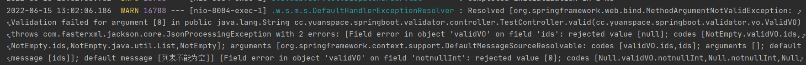

### 参数校验

[toc]


> 校验参数在项目中是很常见的，在java中，几乎每个有入参的方法，在执行下一步操作之前，都要验证参数的合法性，比如是入参否为空，数据格式是否正确等等，往常的写法就是一大推的if-else,既不美观也不优雅，这个时候JCP组织站出来了，并且制定了一个标准来规范校验的操作，这个标准就是Java Validation API(JSR 303)  
>  

#### 依赖

接口  
一般不需要直接引入，当暴露的RPC接口的Api包里需要对DTO对象进行校验时，就需要引入了
```xml
<!-- api改名了，原先为javax.validaion>>validation-api -->
<dependency>
    <groupId>jakarta.validation</groupId>
    <artifactId>jakarta.validation-api</artifactId>
    <version>2.0.2</version>
</dependency>
```

两个实现：  
第一个hibernate  
提供了 @Valid 注解，可以校验对象参数，但是无法处理单个参数
```xml
<dependency>
    <groupId>org.hibernate.validator</groupId>
    <artifactId>hibernate-validator</artifactId>
    <version>7.0.1.Final</version>
</dependency>

```
第二个实现，spring-boot-starter-validation  
是对hibernate-validator的封装  
提供了 @Validated 注解，可以校验对象参数，方法单个参数，分组校验
```xml
<dependency>
    <groupId>org.springframework.boot</groupId>
    <artifactId>spring-boot-starter-validation</artifactId>
</dependency>
``` 
springboot2.3.x后面都需要手动引入上面两个依赖之一  


通过使用@NotNull等注解配合@Valid或@Validated注解，可以快速实现参数校验  

推荐使用 `validation-api` 中的注解，不推荐`hibernate-validator`中独有的注解，不具有泛用性  

#### 校验注解说明

|注解         |说明                                                       |适用数据类型                                          |
|------------|-----------------------------------------------------------|---------------------------------------------------|
|@NotNull    |被注释的元素不能为null                                         |所有类型，基本类型一定能通过                            |
|@Null       |标记的字段必须为null                                           |所有类型，基本类型一定不通过                            |
|@NotBlank   |不能为空白                                                    |字符串类型                                          |
|@AssertTrue |值必须为true，null值被认为有效                                  |Boolean或boolean类型                                |
|@AssertFalse|值必须为false，null值被认为有效                                 |Boolean或boolean类型                                 |
|@Pattern    |正则表达式匹配，null值有效                                      |字符串类型                                            |
|@Email      |email格式匹配，null值有效                                      |字符串类型                                            |
|@Min        |指定最小值，字段必须大于等于，null值有效，标记多个需要都满足           |数值类型，不支持double、float(也能标记，但是可能出现精度问题) |
|@Max        |指定最大值，字段必须小于等于，null值有效，标记多个需要都满足           |同 @Min                                              |
|@DecimalMin |字段必须大于等于，可以设置是否包含当前值，用字符串设置数字，可以为小数    |数值类型                                              |
|@DecimalMax |字段必须小于等于，可以设置是否包含当前值，用字符串设置数字，可以为小数    |数值类型                                              |
|@Size       |集合、数组、字符串型字段元素个数                                  |集合、数组、字符串                                      |
|@Digits     |标注数字，指定整数位个数和小数位个数                               |数值类型                                             |
|@Past       |被注释的元素必须是一个过去的日期                                  |日期类型                                             |
|@Future     |将来的一个日期                                                |日期类型                                             |
|@Negative   |负数                                                        |数字类型                                              |
|@Positive   |正数                                                        |数字类型                                              |
|@Length     |字符串长度范围                                                |字符串类型                                            |
|@Range      |数字范围                                                     |数值型                                               |


如果注解使用的类型不匹配会抛出 `UnexpectedTypeException` 异常  

#### 快速使用
  
在模型类中需要校验的字段上加上校验注解，message属性定义校验失败后的提示信息  
```java
@Data
public class ValidVO {

    @NotNull(message = "不能为null")
    @NotBlank(message = "字符串不能为空")
    private String name;

    private Integer num;
    @NotEmpty(message = "列表不能为空")
    private List<Long> ids;

    private Integer gender;
}
```
controller 方法参数上加上注解，`@Valid` 或者 `@Validated`都可以
```java
    @PostMapping("/valid")
    public String valid(@RequestBody @Valid ValidVO nv) throws JsonProcessingException {
        System.out.println(om.writeValueAsString(nv));

        return om.writeValueAsString(nv);
    }
```

对于校验不通过的默认会返回 `400 Bad request  `  


在程序控制台打印日志可以看到错误信息



#### 详细用法示例
  
##### 1、方法参数校验  
这种方式必须要在类上标记`@Validated`  
对于普通参数的只需要标记校验注解就可以了，会抛出 `ConstraintViolationException` 异常，返回`500`错误  
 `function(@NotNull paramter, @NotNull paramter) `   


对于对象参数，需要标记 @Valid（不能是 @Validated）， 也会抛出`ConstraintViolationException`异常，不是走下面的`MethodArgumentNotValidException`异常处理
`function(@Valid obj) `  

（这种方法校验不通过时，不能使用下面的BindingResult获取错误消息）
```java
@Validated // 不加这个下面参数上的@NotNull不生效
@RestController
@RequestMapping("/funcParam")
public class FuncParamValidController {
    @PostMapping("/valid")
    public String validFunParam(@NotNull(message = "[name]参数不能为空") String name) {
        return "valid success " + name;
    }
    @PostMapping("/validObj")
    public Map<String, Object> validObj(@RequestBody @Valid ValidVO vo) {
        return null;
    }

}
```


##### 2、对象参数  
function(@Valid object)    
最常用的，方法参数是个对象，对象内的字段标记校验注解  
方法上标记 `@Valid` `@Validated` 效果是一样的

```java
@Data
public class ValidVO {

    // 默认为0，一定通过
    @NotNull(message = "基本类型不能为null")
    // 指定正数，0不是正数
    @Positive(message = "基本数值必须为正数")
    private int a;

    // 一定不通过，默认为0
    // @Null(message = "基本数值类型必须为null")
    private int notnullInt;

    @NotNull(message = "不能为null")
    @NotBlank(message = "字符串不能为空")
    private String name;

    @AssertTrue(message = "字段[boolTrue]必须为true")
    private Boolean boolTrue;
    @AssertFalse(message = "字段[boolFalse]必须为false")
    private Boolean boolFalse;

    @Pattern(regexp = "[1-8]{1,5}")
    private String pattern;

    @Email(message = "email格式")
    private String email;

    @Min(value = 10)
    private Integer min;

    @Min(value = 10)
    private Float minf;

    @Min(value = 10)
    private Double mind;

    @Max(value = 10, message = "最大值为10")
    @Max(value = 8, message = "最大值为8")
    private Integer max;

    @DecimalMin(value = "2.5", inclusive = true)
    private BigDecimal decimalMinDouble;

    @DecimalMax(value = "2.5", inclusive = true)
    private BigDecimal decimalMaxDouble;


    @NotEmpty(message = "列表不能为空")
    @Size(min = 1, max = 3, message = "列表元素只能为1-3个")
    private List<Long> ids;

    @Digits(integer = 4, fraction = 2)
    private Integer num;

    @Digits(integer = 5, fraction = 2)
    private BigDecimal num2;

    @JsonDeserialize(using = LocalDateTimeDeserializer.class)
    @JsonSerialize(using = LocalDateTimeSerializer.class)
    @JsonFormat(pattern = "yyyy-MM-dd HH:mm:ss", timezone = "GMT+8")
    @Past(message = "必须是一个过去的时间")
    private LocalDateTime pastDateTime;

    @JsonDeserialize(using = LocalDateTimeDeserializer.class)
    @JsonSerialize(using = LocalDateTimeSerializer.class)
    @JsonFormat(pattern = "yyyy-MM-dd HH:mm:ss", timezone = "GMT+8")
    @Future
    private LocalDateTime futureTime;

    @Negative(message = "一个负数")
    private Integer negative;

    @Positive(message = "一个正数")
    private Integer positive;

}
```


##### 3、嵌套校验  
当需要校验对象成员的属性时，就需要使用嵌套校验  
在成员对象的属性上添加`@Valid`注解，`@Validated` 不支持标记字段  

```java
@Data
public class NestedValidVO {

    @NotBlank(message = "[name]不能为空")
    private String name;

    //对象属性校验
    @Valid
    @NotNull(message = "[subValidVO]对象不能为空")
    private SubValidVO subValidVO;

    @Data
    public static class SubValidVO {
        @NotBlank(message = "子对象[subName]不能为空")
        private String subName;
    }
}
```


##### 4、分组校验   
分组校验可以实现对于不同的方法，校验不同的字段  
只能通过`@Validated` 注解实现分组校验  
给校验注解指定分组class，任意class都行只要能区分就行  
@Validated指定要处理的分组class，如果不指定则 **只能处理未分组** 的校验注解

```java
@Data
public class GroupValidVO {

    public interface Group1{}
    public interface Group2{}

    @NotBlank(groups = Group1.class)
    private String name;

    @NotNull(message = "[num]不能为空", groups = Group1.class)
    @Min(value = 10, message = "[num]最小为10", groups = {Group1.class, Group2.class})
    private Integer num;

    @Email(message = "非法的email格式", groups = Group2.class)
    private String email;

    @NotBlank(message = "[nonGroup]不为空")
    private String nonGroup;
}
// -------------------
    @PostMapping("/validGroup1")
    public String validGroup1(@RequestBody @Validated(value = GroupValidVO.Group1.class) GroupValidVO vo) throws JsonProcessingException {
        return om.writeValueAsString(vo);
    }
```

##### 5、自定义注解和校验规则  

```java
/**
 * 自定义校验注解
 * 校验字符串是否为 abc
 * 需要指定校验器
 */
@Constraint(validatedBy = IsABCValidator.class)
@Target(ElementType.FIELD)
@Retention(RetentionPolicy.RUNTIME)
public @interface IsABC {
    String message() default "";

    Class<?>[] groups() default { };

    Class<? extends Payload>[] payload() default { };
}
```
```java
public class IsABCValidator implements ConstraintValidator<IsABC, String> {
    @Override
    public boolean isValid(String value, ConstraintValidatorContext context) {
        if (value != null) {
            return "abc".equalsIgnoreCase(value);
        }
        return false;
    }
}
```

##### 6、编程式校验--Validator对象  
@Valid和@Validated只能用在参数校验上
但如果需要在代码执行过程需要校验对象数据，这种方法就不行了  
可以封装Validator对象，手动校验，封装返回结果

```java
public class ValidatorUtil {
    private static final Validator validator = Validation.buildDefaultValidatorFactory().getValidator();

    public static Set<String> valid(Object obj) throws JsonProcessingException {
        // 执行校验 返回
        Set<ConstraintViolation<Object>> violationSet = validator.validate(obj);
        Set<String> res = new HashSet<>();
        for (ConstraintViolation<Object> constraintViolation : violationSet) {
            // 错误描述
            String message = constraintViolation.getMessage();
            // 当前值
            Object invalidValue = constraintViolation.getInvalidValue();
            res.add(message + " current value is [" + invalidValue + "]");
        }
        return res;
    }
}
```

##### 7、快速失败(Fail Fast)配置
注入一个bean，修改配置
```java
    @Bean
    public Validator validator() {
        ValidatorFactory validatorFactory = Validation.byProvider(HibernateValidator.class)
                .configure()
                // 快速失败模式
                .failFast(true)
                .buildValidatorFactory();
        return validatorFactory.getValidator();
    }
```
改造下ValidatorUtil
```java
// 上面已经创建了Validator 的bean对象，这里直接注入工具类里
    @Bean
    public ValidatorUtil validatorUtil(Validator validator) {
        return new ValidatorUtil(validator);
    }

public class ValidatorUtil {
    private static Validator validator;

    public ValidatorUtil(Validator validator) {
        ValidatorUtil.validator = validator;
    }

    public static Set<String> valid(Object obj) {
        // 执行校验 返回
        Set<ConstraintViolation<Object>> violationSet = validator.validate(obj);
        Set<String> res = new HashSet<>();
        for (ConstraintViolation<Object> constraintViolation : violationSet) {
            // 错误描述
            String message = constraintViolation.getMessage();
            // 当前值
            Object invalidValue = constraintViolation.getInvalidValue();
            res.add(message + " current value is [" + invalidValue + "]");
        }
        return res;
    }
}
```

##### 8、BindingResult   
当校验不通过时需要获取错误信息，可以使用BindingResult获取校验结果  
需要放在@Valid标记的参数的紧挨着的下一个参数位置
```java
@Validated
@RestController
@RequestMapping("/bindResult")
public class BindResultValidController {
    ObjectMapper om = new ObjectMapper();

    /**
     * 由于类上标注了@Validated，所以这里必须使用@Validated，否则就抛出ConstraintViolationException异常
     * 而不是封装到BindingResult对象中
     */
    @PostMapping("/valid")
    public Map<String, Object> valid(@RequestBody @Validated ValidVO vo, BindingResult bindingResult) throws JsonProcessingException {
        List<ObjectError> allErrors = bindingResult.getAllErrors();
        StringBuilder sb = new StringBuilder();
        for (ObjectError error : allErrors) {
            sb.append(error.getDefaultMessage()).append(";");
        }
        Map<String, Object> res = new HashMap<>();
        res.put("errmsg", sb.toString());
        return res;
    }

    /**
     * 这种不支持BindingResult 异常被抛出了
     */
    @GetMapping("/validFun")
    public Map<String, Object> validFun(@NotNull(message = "[name]参数不能为空") String name, BindingResult bindResult) throws JsonProcessingException {
        System.out.println(name);
        System.out.println(bindResult.getAllErrors().stream().map(DefaultMessageSourceResolvable::getDefaultMessage).collect(Collectors.toList()));
        return new HashMap<>();
    }
}
```

##### 9、统一异常处理
当参数校验不通过时，会抛出 `MethodArgumentNotValidException` 和 `ConstraintViolationException` 异常  
对于`MethodArgumentNotValidException`异常，SpringBoot会通过默认处理器打印log，返回400 bad request
而`ConstraintViolationException` 异常则会被抛出，最终返回500服务端错误
每次都使用BindingResult获取结果太麻烦，就可以定义全局异常处理，自行处理这两种异常，定义响应信息  

```java
@RestControllerAdvice
public class GlobalExceptionHandler {

    private static final Logger log = LoggerFactory.getLogger(GlobalExceptionHandler.class);

    @ExceptionHandler(value = ConstraintViolationException.class)
    public ResponseEntity<Map<String, Object>> constraintViolationExceptionHandle(ConstraintViolationException e) {
        log.error("ConstraintViolationException", e);
        Set<ConstraintViolation<?>> constraintViolations = e.getConstraintViolations();
        StringBuilder sb = new StringBuilder();
        for (ConstraintViolation<?> violation : constraintViolations) {
            String message = violation.getMessage();
            Object invalidValue = violation.getInvalidValue();
            sb.append(message).append(":").append(invalidValue).append("\n");
        }
        Map<String, Object> r = new HashMap<>();
        r.put("errcode", 1);
        r.put("errmsg", sb.toString());
        return new ResponseEntity<>(r, HttpStatus.OK);
    }

    @ExceptionHandler(value = MethodArgumentNotValidException.class)
    public ResponseEntity<Map<String, Object>> MethodArgumentNotValidExceptionHandle(MethodArgumentNotValidException e) {
        log.error("MethodArgumentNotValidException", e);
        // MethodArgumentNotValidException 异常 需要从BindingResult中提取错误信息
        BindingResult bindingResult = e.getBindingResult();
        StringBuilder sb = new StringBuilder();
        for (ObjectError error : bindingResult.getAllErrors()) {
            sb.append(error.getDefaultMessage()).append(";");
        }
        Map<String, Object> r = new HashMap<>();
        r.put("errcode", 1);
        r.put("errmsg", sb.toString());
        return new ResponseEntity<>(r, HttpStatus.OK);
    }

     @ExceptionHandler(value = Exception.class)
     public ResponseEntity<Map<String, Object>> exceptionHandle(Exception e) {
         log.error("exception", e);

         Map<String, Object> r = new HashMap<>();
         r.put("errcode", 1);
         r.put("errmsg", "系统繁忙，请稍后重试！");
         return new ResponseEntity<>(r, HttpStatus.OK);
     }
}
```


----
额外说明：   
校验注解都是可以在一个字段上重复标记的，校验不通过所有的message都会返回的  
注解上都有 `@Repeatable(List.class)` 说明是可重复的


