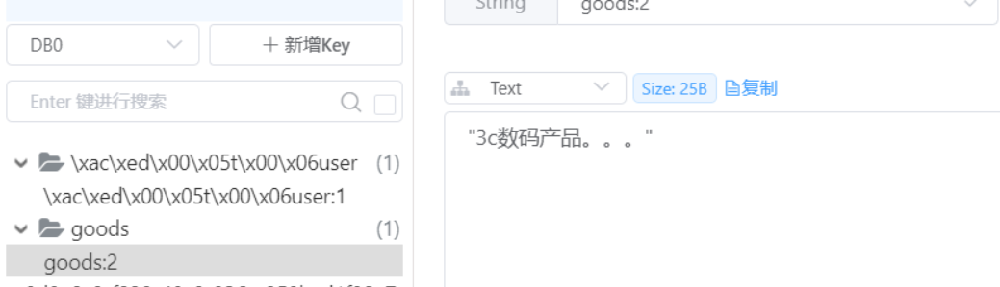
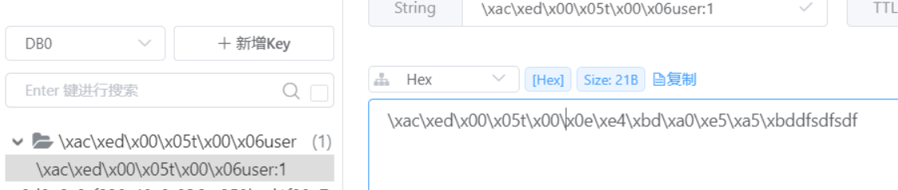
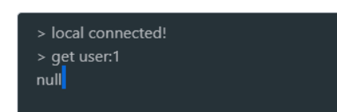
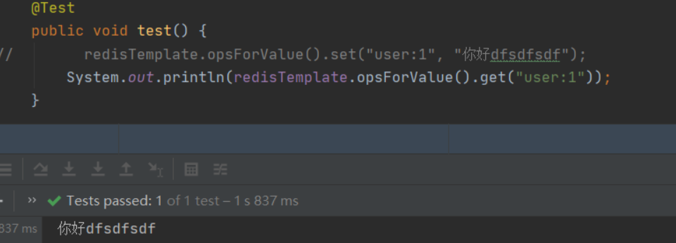

## 整合 Redis
单机版
### 1、添加依赖
```xml
<dependency>
    <groupId>org.springframework.boot</groupId>
    <artifactId>spring-boot-starter-data-redis</artifactId>
</dependency>
<!-- redis依赖commons-pool 这个依赖一定要添加 -->
<dependency>
    <groupId>org.apache.commons</groupId>
    <artifactId>commons-pool2</artifactId>
</dependency>
```

### 2、配置文件
```properties
# redis 配置
spring.redis.host=127.0.0.1
spring.redis.port=6379
spring.redis.password=
spring.redis.database=0
# 可以带单位
spring.redis.timeout=10000ms
spring.redis.lettuce.pool.enabled=true
spring.redis.lettuce.pool.max-active=8
spring.redis.lettuce.pool.max-idle=8
spring.redis.lettuce.pool.max-wait=1000
spring.redis.lettuce.pool.min-idle=8
```


### 3、配置类

配置一个 `RedisTemplate<String, Object>`，并指定 key 和 value 的序列化器。  

```java
/**
* redis配置类，主要配置序列化
*/
@Configuration
public class RedisConfig {

    @Bean
    public RedisTemplate<String, Object> redisTemplate(RedisConnectionFactory factory) {
        RedisTemplate<String, Object> redisTemplate = new RedisTemplate<>();
        // 连接工厂必须指定
        redisTemplate.setConnectionFactory(factory);
        // 字符串序列化器
        StringRedisSerializer stringRedisSerializer = new StringRedisSerializer();
        // json 序列化器，使用 jackson
        // 还有一种是 Jackson2JsonRedisSerializer<Object> serializer = new Jackson2JsonRedisSerializer<>(Object.class);
        GenericJackson2JsonRedisSerializer genericJackson2JsonRedisSerializer = new GenericJackson2JsonRedisSerializer();
        // key 和 hashkey 设置字符串序列化
        redisTemplate.setKeySerializer(stringRedisSerializer);
        redisTemplate.setHashKeySerializer(stringRedisSerializer);
        // 值设置 json 序列化
        redisTemplate.setValueSerializer(genericJackson2JsonRedisSerializer);
        redisTemplate.setHashValueSerializer(genericJackson2JsonRedisSerializer);
        redisTemplate.afterPropertiesSet();
        return redisTemplate;
    }
}
```
```java
// 测试
@Test
public void test2() {
    redisTemplate.opsForValue().set("goods:2", "3c数码产品。。。");
}
```


<br/>
<br/>

如果不配置序列化器，直接使用默认的，key 和 value 在客户端上显示会是乱码，客户端命令行也会操作错误     

如下：
```java
/**
* redis配置类，主要配置序列化
*/
@Configuration
public class RedisConfig {

    @Bean
    public RedisTemplate<String, Object> redisTemplate(RedisConnectionFactory factory){
        RedisTemplate<String, Object> redisTemplate = new RedisTemplate<>();
        redisTemplate.setConnectionFactory(factory);
        return redisTemplate;
    }
}
```
```java
// 测试
@Test
public void test() {
    redisTemplate.opsForValue().set("user:1", "你好dfsdfsdf");
}
```
连接工具查看乱码


命令行读取失败


只能从代码里读取


**当然这也并不算什么问题，因为操作数据都是使用 Java API 操作的**