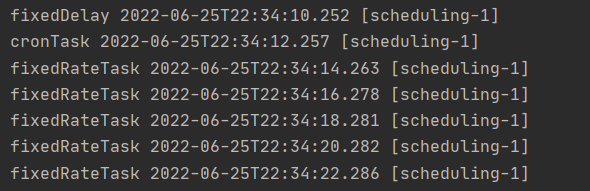
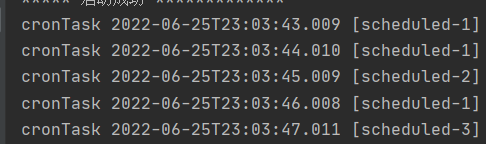

### Springboot 自带的任务调度

#### 第一步 @EnableScheduling
在配置类上标注 `@EnableScheduling` 注解开启任务调度

```java
// 开启任务调度
@EnableScheduling
@SpringBootApplication
public class App {
    public static void main(String[] args) {
        SpringApplication.run(App.class, args);

        System.out.println("***** 启动成功 *************");
    }
}
```
#### 第二步 @Scheduled
在需要进行调度的 bean 的方法上标注 `@Scheduled` 注解

```java
@Component
public class ScheduledTask {

    /**
     * cron 表达式
     *      [* * * * * ?]
     * 表示 [秒 分 时 日 月 周]
     * 	  <li>second</li>
     * 	  <li>minute</li>
     * 	  <li>hour</li>
     * 	  <li>day of month</li>
     * 	  <li>month</li>
     * 	  <li>day of week</li>
     * 日和周有冲突，其中一个必须为 ?
     */
    @Scheduled(cron = "0/1 * * * * ?")
    public void cronTask() {
        System.out.println("cronTask " + LocalDateTime.now() + " [" + Thread.currentThread().getName() + "] ");
        try {
            Thread.sleep(2000);
        } catch (InterruptedException e) {
            e.printStackTrace();
        }
    }
}
```

`@Scheduled` 主要参数说明

> cron 最常用的方式，通过表达式定义调度时机
> fixedDelay 固定延时，上一次调度结束时计时
> fixedRate 固定频率，上一次调度开始时计时，如果任务执行时间超过等待时间，则任务结束立即开始下一次调度
> initialDelay 第一次调度等待延时
> timeUnit 除 cron 之外其他参数的时间单位


#### 配置线程池

默认情况下，任务调度是单线程的，任务之间执行时间会互相影响


可以通过配置线程池，使得多线程调度任务
```java
@Configuration
public class ScheduledConfig implements SchedulingConfigurer {
    private static final Logger log = LoggerFactory.getLogger(ScheduledConfig.class);

    @Override
    public void configureTasks(ScheduledTaskRegistrar taskRegistrar) {
        taskRegistrar.setScheduler(taskScheduler());
    }

    /**
     * 这里配置 Spring 提供的调度线程池
     * 也可以配置 ThreadPoolTaskExecutor 进行更细粒度的参数配置
     */
    @Bean
    public TaskScheduler taskScheduler() {
        ThreadPoolTaskScheduler taskScheduler = new ThreadPoolTaskScheduler();
        // 设置线程数
        taskScheduler.setPoolSize(8);
        // 设置默认线程名称
        taskScheduler.setThreadNamePrefix("scheduled-");
        // 设置拒绝策略
        taskScheduler.setRejectedExecutionHandler(new ThreadPoolExecutor.CallerRunsPolicy());
        // 等待所有任务结束后再关闭线程池
        taskScheduler.setWaitForTasksToCompleteOnShutdown(true);
        // 设置线程池中任务的等待时间，如果超过这个时候还没有销毁就强制销毁，以确保应用最后能够被关闭，而不是阻塞住
        taskScheduler.setAwaitTerminationSeconds(60);
        return taskScheduler;
    }
}
```



